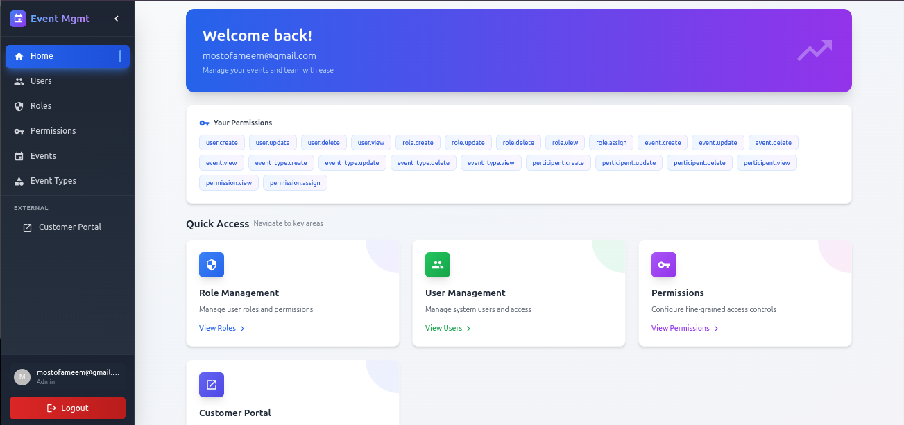
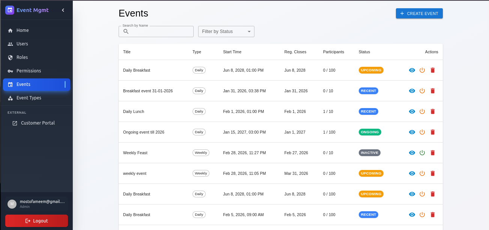
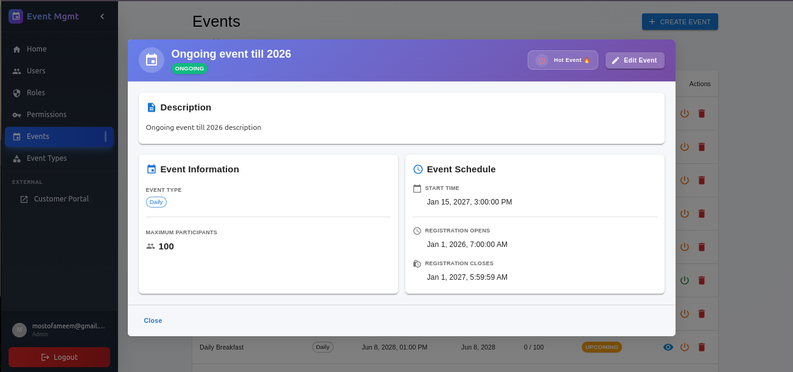
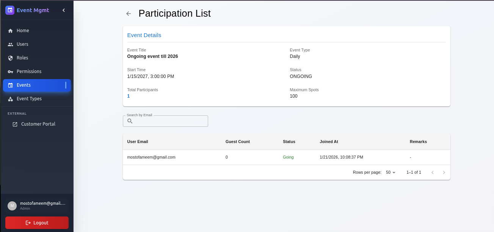
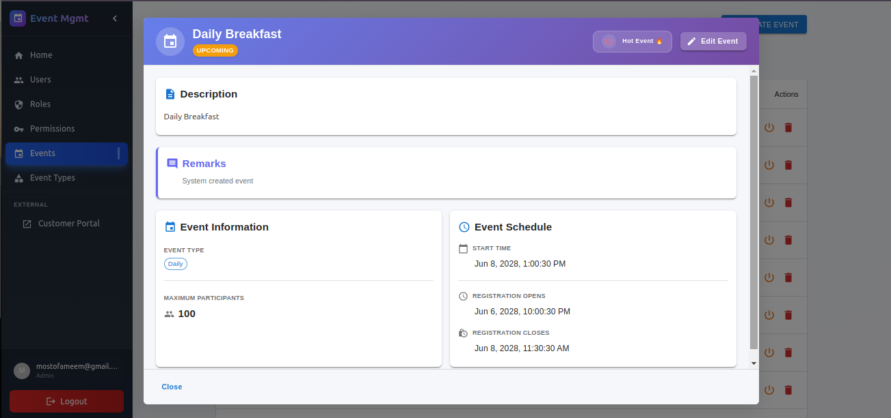
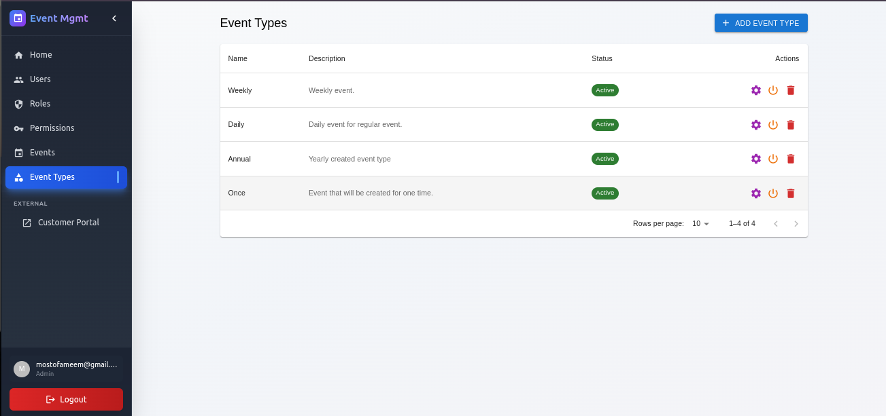
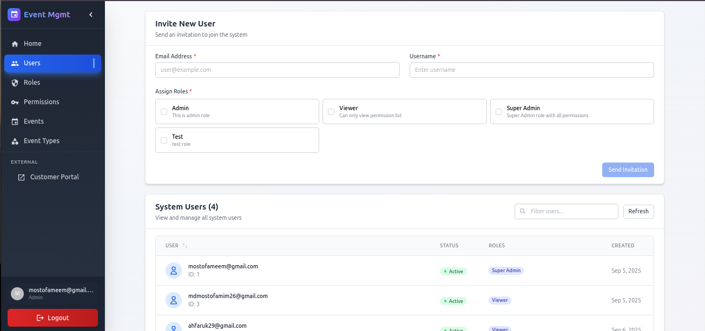
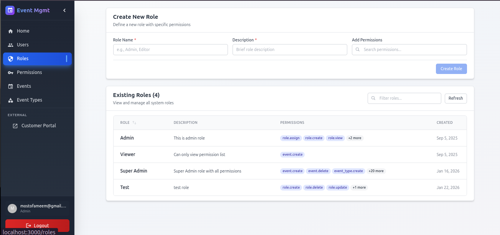

# Event Management System

## 🧭 The Problem

Think about your daily life — how many events do you attend or organise? Team meetings, community gatherings, office lunches, weekly workshops, social hangouts. Each one requires someone to sit down, create the event, send out invites, keep track of who's coming, and then — if it's a recurring event — do the whole thing all over again next week. And the week after that. Forever.

That repetitive burden falls on someone's shoulders. And over time, it becomes exactly what it sounds like: a chore.

We've all been there. You're the one responsible for organising the Friday team lunch or the monthly all-hands. You set it up manually every single time. You track participants in a spreadsheet. You lose count. You forget who cancelled. You rebuild the list from scratch.

**There had to be a better way.**

## 💡 The Solution

**Event Management System** was built to take that pain away.

It's a web-based platform that lets you:

- **Create and manage events** with a clean, intuitive interface
- **Set participant limits** so you always know your capacity
- **Track participants** in real time — who signed up, who cancelled, their history
- **Auto-create recurring events** with the *Hot Events* feature — set it once, and the system recreates the event automatically on schedule, no human involvement needed

The Hot Events engine was the core motivation behind this project. For teams or communities that run the same type of event repeatedly — daily standups, weekly socials, monthly reviews — this system removes the repetitive manual work entirely. The system handles it. You focus on the event itself, not the logistics of setting it up.

## 🏗️ What It Does

- Role-based access control (RBAC) — control who can create, manage, and view events
- Event lifecycle management — from creation to completion
- Participant tracking with guest count support
- Auto-recreate recurring events via the **Hot Events** scheduler
- Real-time event status (Upcoming, Ongoing, Ended)
- Admin portal for full control + Customer portal for participants

---

## 📸 Screenshots

### 🏠 Home


### 📅 Events


### 🔍 Event Details


### 👥 Event Participation


### 🤖 System Created Event (Hot Event)


### 🗂️ Event Types


### 👤 Users


### 🔐 Roles


---

## 🚀 Future Work

The current system is functional and solves the core problem, but there's more to build. Here's what's planned next:

### 🔔 User Notifications
Participants and event managers should never miss an update. Planned notification features include:
- Email/in-app alerts when a new event is created (especially auto-created Hot Events)
- Reminders before registration opens or closes
- Notifications when an event is about to start or has been cancelled

### 🤝 User Auto-Participation
For truly recurring events where attendance is expected by default:
- Users will be able to opt-in to **auto-participate** in specific event types
- When a Hot Event is auto-created, opted-in users will be automatically registered as participants
- Admin controls to manage auto-participation lists per event type

---

## Table of Contents


- [Installation](#installation)
- [Usage](#usage)
- [Deployment](#deployment)
- [Credits](#credits)
- [Contributing](#contributing)

## Installation

## 1. **Clone the repository**
   ```bash
   git clone https://github.com:mostofameem/identity-rbac.git
   cd identity-rbac
   ```

## 2.  🚀 Project Initialization Guide

Follow the steps below to set up and run the project smoothly:

---

### ✅ Step 1: Environment Variables

Create a `.env` file from the provided example:

```bash
cp .env.example .env
```


### ✅ Step 2: Database Migration
Initialize the required database tables:   

    make migrate

Alternative
```bash
go run main.go serve-migrate
```

This command will create all schema migrations.

### ✅ Step 3: Data Seeding
Populate the database with essential seed data: 

    make seeding

Alternative
```bash
go run main.go serve-seeding
```

This includes default modules for initial use.

### ✅ Step 4: Super Admin Setup
Create the configuration file for the super admin user:
```bash
cp user_config.example.json user_config.json
```

Then, open user_config.json and provide the super admin's credentials:

    {
        "userEmail": "",
        "userPassword": ""
    }

Now, run the user creation command:

    make add-user

Alternative
```bash
go run main.go serve-add-user
```

This will create the super admin user with full system access.


## 3. Run the Project
   Using Docker
   ```bash
   docker-compose build
   docker-compose up -d
   ```

   Run With Air
   
   ```bash
   make dev
   ```
   Run Using main
   ```bash
   go run main.go serve-rest
   ```

## 4. Usage

- Access the web app swagegr at `http://localhost:5001/swagger`.
- Features include:
  - Create Role
  - Asign role to user
  - Create Permission
  - Add permission to role

## 5. Credits

- **Backend**: Go
- **Database**: PostgreSQL

Developed by Mostofa Meem

## Deployment

For production deployment to AWS EC2 with CI/CD, see the **[deployment](deployment/)** folder:

- 🚀 **[Quick Start Guide](deployment/docs/DEPLOYMENT_QUICKSTART.md)** - 10-minute setup
- 📖 **[Complete Deployment Guide](deployment/docs/DEPLOYMENT.md)** - Comprehensive instructions
- 🗄️ **[Database Setup Guide](deployment/docs/DATABASE_SETUP.md)** - PostgreSQL configuration

### Quick Deploy Summary:
1. Set up PostgreSQL database (AWS RDS, DigitalOcean, etc.)
2. Launch EC2 instance and run setup script
3. Configure GitHub secrets
4. Push to main branch → automatic deployment!

## 6. Contributing

Contributions are welcome! Follow these steps:

1. Fork the repository
2. Create a new branch (`git checkout -b feature-xyz`)
3. Commit your changes (`git commit -am 'Add new feature'`)
4. Push to the branch (`git push origin feature-xyz`)
5. Open a Pull Request
